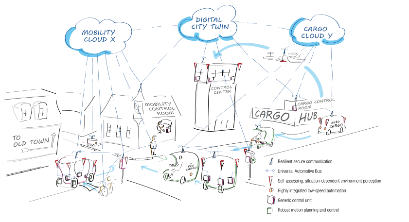

# autotech.agil - Advancing tools and architectures for automated and connected mobility systems

Welcome to the official GitHub space for open-source projects from the [autotech.agil](https://www.autotechagil.de) project. Here, you'll find a comprehensive overview of our **open-source contributions**, as well as **demonstration repositories** that showcase the combined utility of our various projects.

## Demonstration Repositories

| Repository | Description | Partner(s) | References | 

 | 
| --- | --- | --- | :---: | :---: |
| [Sample Repository](https://github.com/TBD) | Short description of the repository | Contributing Partner(s) |    [Paper (2024)](https://TBD) |  |

## Open-Source Contributions

### Sense

| Repository | Description | Partner(s) | References | 

 | 
| --- | --- | --- | :---: | :---: |
| [Sample Repository](https://github.com/TBD) | Short description of the repository | Contributing Partner(s) |    [Paper (2024)](https://TBD) |  |

### Plan

| Repository | Description | Partner(s) | References | 

 | 
| --- | --- | --- | :---: | :---: |
| [Sample Repository](https://github.com/TBD) | Short description of the repository | Contributing Partner(s) |    [Paper (2024)](https://TBD) |  |

### Act

| Repository | Description | Partner(s) | References | 

 | 
| --- | --- | --- | :---: | :---: |
| [Sample Repository](https://github.com/TBD) | Short description of the repository | Contributing Partner(s) |    [Paper (2024)](https://TBD) |  |

### V2X & Communication

| Repository | Description | Partner(s) | References | 

 | 
| --- | --- | --- | :---: | :---: |
| [Sample Repository](https://github.com/TBD) | Short description of the repository | Contributing Partner(s) |    [Paper (2024)](https://TBD) |  |

### Simulation & Safety Assurance

| Repository | Description | Partner(s) | References | 

 | 
| --- | --- | --- | :---: | :---: |
| [Sample Repository](https://github.com/TBD) | Short description of the repository | Contributing Partner(s) |    [Paper (2024)](https://TBD) |  |

### DevOps & Middleware

| Repository | Description | Partner(s) | References | 

 | 
| --- | --- | --- | :---: | :---: |
| [Sample Repository](https://github.com/TBD) | Short description of the repository | Contributing Partner(s) |    [Paper (2024)](https://TBD) |  |

### Education

| Repository | Description | Partner(s) | References | 

 | 
| --- | --- | --- | :---: | :---: |
| [Sample Repository](https://github.com/TBD) | Short description of the repository | Contributing Partner(s) |    [Paper (2024)](https://TBD) |  |
