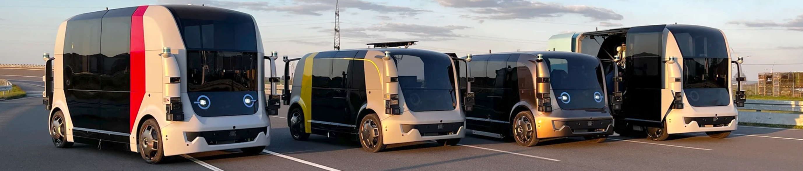

# autotech.agil | Architectures and Tools for  Automated and Connected Mobility Systems

Welcome to the official GitHub space for open-source projects from the [autotech.agil](https://www.autotechagil.de) project. Here, you'll find a comprehensive overview of our **open-source contributions**, as well as **demonstration repositories** that showcase the combined utility of our various projects.

### The autotech.agil project

The [autotech.agil](https://www.autotechagil.de) consortium project aims to create an open software and electrical/electronic architecture for the future mobility system. The special focus is on the **standardization of interfaces** as well as modularization with the aim of reusability, updatability, and expandability of individual functional modules.

This **modular principle of all necessary software and hardware elements** for vehicles of all types makes it easy to implement additions and extensions in research, development, production, and, above all, in the utilization phase.

The architecture for driverless vehicles researched and developed in the predecessor project [UNICARagil](https://www.unicaragil.de) is being **extended to the entire transportation system**, especially in the areas of software and tools for software development. Infrastructure-based sensor technology and cooperative concepts with control rooms and clouds are also being researched in depth.

Successful achievement of the project goal is only possible through interdisciplinary cooperation between leading partners from research with 17 chairs at nine universities and industry with three SMEs and nine companies in the field of automated and connected driving.

>The research project is funded by the German Federal Ministry of Education and Research (BMBF) under grant agreement number 01IS22088.

## Demonstration Repositories

>Cross-partner demo repositories will be collected here, which demonstrate project results using exemplary use cases.

| Repository | Description | References | 

 | 
| --- | --- | --- | --- |
| TBD | TBD | TBD | TBD |

## Open-Source Contributions

### V2X & Communication

| Repository | Description | References | 

 | 
| --- | --- | --- | :---: |
| [amqp_topic_transceiver](https://github.com/uulm-mrm/amqp_topic_transceiver) | Transmitting binary ROS2 messages over AMQP connections |  |  |
| [etsi_its_messages](https://github.com/ika-rwth-aachen/etsi_its_messages) | ROS support for ETSI ITS messages: Use standardized ETSI ITS messages for V2X communication in ROS systems |    [Paper (2024)](https://arxiv.org/abs/2403.10221) |  |
| [v2x_etsi_asn1](https://github.com/uulm-mrm/v2x_etsi_asn1) | Transmitting UPER ASN.1 encoded ETSI messages over AMQP connections |  |  |

### Simulation & Safety Assurance

| Repository | Description | References | 

 | 
| --- | --- | --- | :---: |
| [CARLOS](https://github.com/ika-rwth-aachen/carlos) | An Open, Modular, and Scalable Simulation Framework for the Development and Testing of Software for C-ITS: Take CARLA simulation to the next level |    [Paper (2024)](http://arxiv.org/abs/2404.01836) |  |

### DevOps & Middleware

| Repository | Description | References | 

 | 
| --- | --- | --- | :---: |
| [docker-ros](https://github.com/ika-rwth-aachen/docker-ros) | Microservice-based Development and Deployment: Containerize your ROS / ROS 2 packages or package stacks for simple deployment |    [Paper (2023)](https://arxiv.org/abs/2309.06611) |  |
| [RobotKube](https://github.com/ika-rwth-aachen/robotkube) | Fully automated fleet orchestration: Orchestrate large-scale cooperative multi-robot systems with Kubernetes and the Robot Operating System |    [Paper (2023)](https://ieeexplore.ieee.org/document/10422370) |  |

### Education

| Repository | Description | References | 

 | 
| --- | --- | :---: | :---: |
| [Automated & Connected Driving Challenges (edX.org)](https://github.com/ika-rwth-aachen/acdc) | ACDC MOOC: Gain practical experience in automated driving with coding exercises that teach you the latest methods and tools |       [edX Course](https://www.edx.org/learn/automation/rwth-aachen-university-automated-and-connected-driving-challenges) |  |
