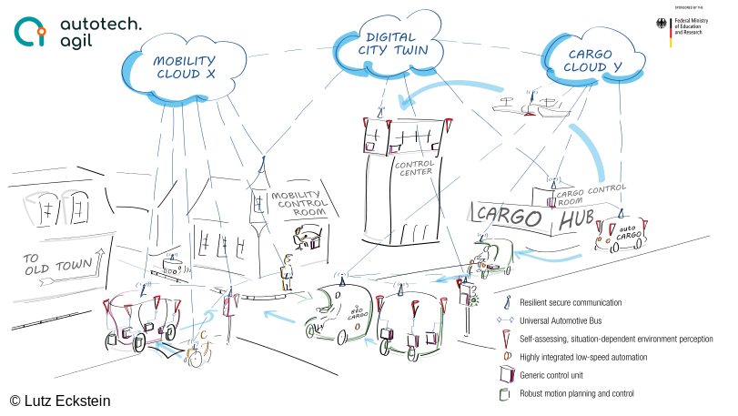

# autotech.agil | Architectures and Tools for Automated and Connected Mobility Systems

Welcome to the official GitHub space for open-source projects from the [autotech.agil](https://www.autotechagil.de) project. Here, you'll find a comprehensive overview of our **open-source contributions**, as well as **demonstration repositories** that showcase the combined utility of our various projects.

>The [autotech.agil](https://www.autotechagil.de) consortium project aims to create an open software and electrical/electronic architecture for the future mobility system. The special focus is on the **standardization of interfaces** as well as modularization with the aim of reusability, updatability, and expandability of individual functional modules. This **modular principle of all necessary software and hardware elements** for vehicles of all types makes it easy to implement additions and extensions in research, development, production, and, above all, in the utilization phase. The architecture for driverless vehicles researched and developed in the predecessor project [UNICARagil](https://www.unicaragil.de) is being **extended to the entire transportation system**, especially in the areas of software and tools for software development. Infrastructure-based sensor technology and cooperative concepts with control rooms and clouds are also being researched in depth. Successful achievement of the project goal is only possible through interdisciplinary cooperation between leading partners from research with 17 chairs at nine universities and industry with three SMEs and nine companies in the field of automated and connected driving. The research project is funded by the German Federal Ministry of Education and Research (BMBF, FKZ: 01IS22088).

## Demonstration Repositories

| Repository | Description | Partner(s) | References | 

 | 
| --- | --- | --- | :---: | :---: |
| [Sample Repository](https://github.com/TBD) | Short description of the repository | Contributing Partner(s) |    [Paper (2024)](https://TBD) |  |

## Open-Source Contributions

### Sense

| Repository | Description | Partner(s) | References | 

 | 
| --- | --- | --- | :---: | :---: |
| [Sample Repository](https://github.com/TBD) | Short description of the repository | Contributing Partner(s) |    [Paper (2024)](https://TBD) |  |

### Plan

| Repository | Description | Partner(s) | References | 

 | 
| --- | --- | --- | :---: | :---: |
| [Sample Repository](https://github.com/TBD) | Short description of the repository | Contributing Partner(s) |    [Paper (2024)](https://TBD) |  |

### Act

| Repository | Description | Partner(s) | References | 

 | 
| --- | --- | --- | :---: | :---: |
| [Sample Repository](https://github.com/TBD) | Short description of the repository | Contributing Partner(s) |    [Paper (2024)](https://TBD) |  |

### V2X & Communication

| Repository | Description | Partner(s) | References | 

 | 
| --- | --- | --- | :---: | :---: |
| [Sample Repository](https://github.com/TBD) | Short description of the repository | Contributing Partner(s) |    [Paper (2024)](https://TBD) |  |

### Simulation & Safety Assurance

| Repository | Description | Partner(s) | References | 

 | 
| --- | --- | --- | :---: | :---: |
| [Sample Repository](https://github.com/TBD) | Short description of the repository | Contributing Partner(s) |    [Paper (2024)](https://TBD) |  |

### DevOps & Middleware

| Repository | Description | Partner(s) | References | 

 | 
| --- | --- | --- | :---: | :---: |
| [Sample Repository](https://github.com/TBD) | Short description of the repository | Contributing Partner(s) |    [Paper (2024)](https://TBD) |  |

### Education

| Repository | Description | Partner(s) | References | 

 | 
| --- | --- | --- | :---: | :---: |
| [Sample Repository](https://github.com/TBD) | Short description of the repository | Contributing Partner(s) |    [Paper (2024)](https://TBD) |  |
